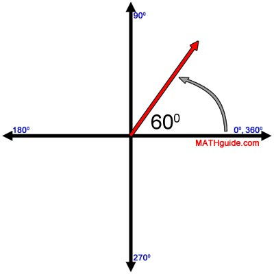
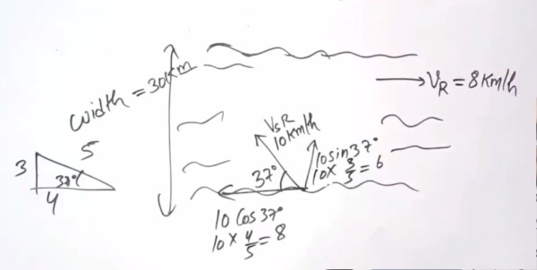
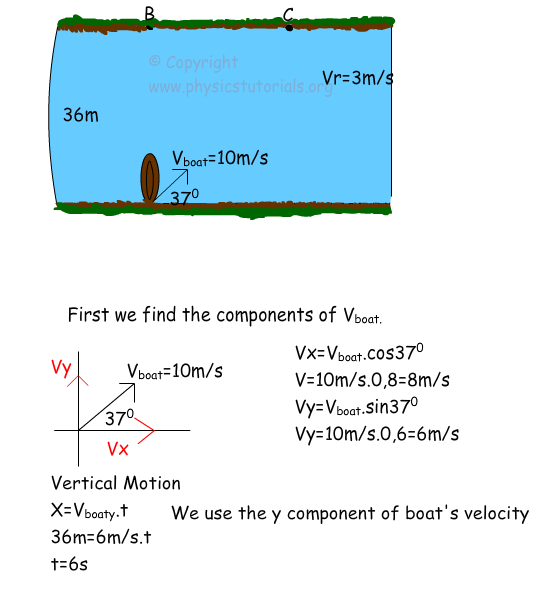

# Getting Started with Create React App


In the project directory, you can run:

### `npm start`

Runs the app in the development mode.\
Open [http://localhost:3000](http://localhost:3000) to view it in the browser.


## Angle to take 
```
all angel will start form the right side 0 degree  front would be 90 and left is more then 90 
```



## Approach to solve a problem






